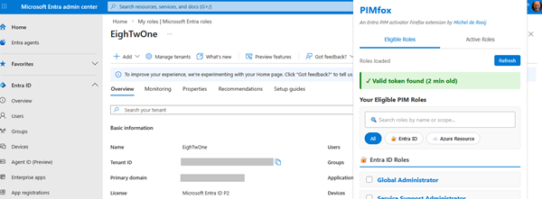

# PIMfox for Entra

A Firefox extension that allows you to activate multiple PIM (Privileged Identity Management) roles simultaneously in Microsoft Entra and Azure resources.

## Overview

PIMfox for Entra streamlines the activation of multiple PIM roles across Microsoft Entra and Azure subscriptions. Instead of activating roles individually through each role's portal, this extension lets you select and activate multiple roles at once, saving time and reducing administrative overhead.

  ["assets/screenshot.png"]()

It works by catching bearer tokens from requests to Microsoft Graph or Azure Management APIs. It then stores those tokens within your browser's local storage and uses them to obtain and activate your selected PIM roles.

## Features

- Activate multiple PIM roles simultaneously (Entra ID and Azure resources)
- Customizable activation duration
- Simple and intuitive user interface
- Secure authentication using the existing browser bearer token
- Notification system for role activation status
- Search and filter roles
- Active roles monitoring with countdown timers

## Installation

### From Firefox Add-ons store 

The extension is available in the add-in store at [https://addons.mozilla.org/en-US/firefox/addon/pimfox-for-entra/](https://addons.mozilla.org/en-US/firefox/addon/pimfox-for-entra/)

### Manual Installation (testing)

1. Download the .xpi file
2. In Firefox, open the Extensions and Themes menu
3. In Manage Your Extensions, click the gear and select Debug Add-Ons..
3. Click "Load Temporary Add-on..."
4. Select the downloaded .xpi file
5. The extension will be loaded (temporary installation until Firefox restarts)

## Usage

1. Open the Microsoft Entra portal (https://portal.azure.com) and sign in
2. Navigate around briefly to allow the extension to capture your authentication tokens
3. Click on the PIMfox for Entra icon in your Firefox toolbar
4. The extension will display your eligible PIM roles (both Entra ID and Azure resource roles)
5. Use the search box or filters to find specific roles
6. Select the roles you want to activate using the checkboxes
7. Set the activation duration using the slider (default: 8 hours)
8. Enter a justification for the activation
9. (Optional) Add ticket system information
10. Click "Activate Selected Roles"
11. Switch to the "Active Roles" tab to monitor your activated roles with countdown timers

## Limitations

- Unable to activate roles protected by Authentication Contexts

## Security

PIMfox for Entra implements several security measures to protect your credentials:

- **Token Encryption**: All bearer tokens are encrypted using AES-GCM (256-bit) before being stored in local storage
- **Extension-Specific Key**: Encryption keys are derived from the extension's runtime ID, unique per installation
- **No External Transmission**: Tokens never leave your browser - all API calls are made directly to Microsoft endpoints
- **Memory Protection**: Decrypted tokens are only held in memory during active operations
- **Auto-Cleanup**: Tokens can be manually cleared at any time from the extension popup

## Privacy

PIMfox for Entra does not collect or transmit any personal data. All authentication is handled directly within the browser.

## Credits

Shout out to Daniel Bradley for his QuickPIM extension, which led me to create this Firefox extension.

## Contributing

Contributions are welcome! Please feel free to submit a Pull Request.

## Support

If you encounter any issues or have questions, please open an issue on GitHub.

## License

This project is licensed under the MIT License - see the [LICENSE](LICENSE) file for details.
