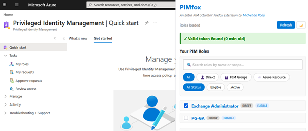

#   PIMfox for Entra

A Firefox extension that allows you to activate multiple PIM (Privileged Identity Management) roles simultaneously in Microsoft Entra and Azure resources.

## Overview

PIMfox for Entra streamlines the activation of multiple PIM roles across Microsoft Entra and Azure subscriptions. Instead of activating roles individually through each role's portal, this extension lets you select and activate multiple roles at once, saving time and reducing administrative overhead.

  

It works by catching bearer tokens from requests to Microsoft Graph or Azure Management APIs. It then stores those tokens within your browser's local storage and uses them to obtain and activate your selected PIM roles.

## Features

- Activate multiple PIM roles simultaneously (Entra ID, Azure resources, and PIM Groups)
- Customizable activation duration
- Reusing authentication when already signed (automatic token capture)
- Inline activation status with spinner and success/error messages
- Search and filter roles by type (Direct, PIM Groups, Azure Resource) and status
- Unified flat role list with type badges (Direct, Group, Resource) and status badges (Eligible, Active)
- Active roles monitoring with countdown timers and a time-remaining progress bar
- Support for PIM-enabled groups
- Dark mode with toggle button (follows OS preference, persisted per browser)
- Firefox Multi-Account Containers support — each container maintains its own independent token and role cache, enabling side-by-side multi-account and multi-tenant workflows

## Installation

### From Firefox Add-ons store 

The extension is available in the [Firefox Add-Ons Extensions store](https://addons.mozilla.org/en-US/firefox/addon/pimfox-for-entra/).

### Manual Installation (testing)

1. Download the .xpi file
2. In Firefox, open the Extensions and Themes menu
3. In Manage Your Extensions, click the gear and select Debug Add-Ons..
3. Click "Load Temporary Add-on..."
4. Select the downloaded .xpi file
5. The extension will be loaded (temporary installation until Firefox restarts)

## Usage

1. Open the Microsoft Entra portal (https://portal.azure.com) and sign in
2. Navigate around briefly to allow the extension to capture your authentication tokens
3. Click on the PIMfox for Entra icon in your Firefox toolbar
4. The extension will display your eligible PIM roles (both Entra ID and Azure resource roles)
5. Use the search box or filters to find specific roles
6. Select the roles you want to activate using the checkboxes
7. Set the activation duration using the slider (default: 8 hours)
8. Enter a justification for the activation
9. (Optional) Add ticket system information
10. Click "Activate Selected Roles"
11. Switch to the "Active Roles" tab to monitor your activated roles with countdown timers

## Limitations

- Unable to activate roles protected by Authentication Contexts

## Security

PIMfox for Entra implements several security measures to protect your credentials:

- **Token Encryption**: All bearer tokens are encrypted using AES-GCM (256-bit) before being stored in local storage
- **Extension-Specific Key**: Encryption keys are derived from the extension's runtime ID, unique per installation
- **No External Transmission**: Tokens never leave your browser - all API calls are made directly to Microsoft endpoints
- **Memory Protection**: Decrypted tokens are only held in memory during active operations
- **Auto-Cleanup**: Tokens can be manually cleared at any time from the extension popup

## How It Works

PIMfox for Entra operates entirely within your browser and relies on the authentication sessions you already have with the Azure portal:

1. **Token capture** — The background script registers `webRequest` listeners that intercept outgoing requests to Microsoft Graph (`graph.microsoft.com`) and Azure Management (`management.azure.com`). A listener for the legacy PIM RBAC API (`api.azrbac.mspim.azure.com`) is retained for passive token capture in case the portal still sends requests to that endpoint. When a request bearing a `Bearer` token is detected, the extension extracts and encrypts it before storing it in browser local storage, scoped to the Firefox container the request originated from. No credentials are ever entered into the extension itself.

2. **Role discovery** — When you open the popup, the extension uses the captured tokens to call the Microsoft Graph and Azure Management REST APIs directly from your browser. It fetches your eligible Entra ID role assignments, PIM-enabled group memberships, and Azure resource role assignments across all subscriptions.

3. **Activation** — When you click **Activate Selected Roles**, the extension submits `roleAssignmentScheduleRequests` directly to the appropriate API endpoint for each role type:
   - **Entra ID roles** → Microsoft Graph (`/v1.0/roleManagement/directory/roleAssignmentScheduleRequests`)
   - **Azure resource roles** → Azure Management API (`/providers/Microsoft.Authorization/roleAssignmentScheduleRequests`)
   - **PIM Groups** → Microsoft Graph (`/v1.0/identityGovernance/privilegedAccess/group/assignmentScheduleRequests`)

4. **Status monitoring** — The Active Roles tab polls the same APIs to track activation state and displays countdown timers until each role expires.

All network traffic goes directly from your browser to Microsoft's own endpoints — there is no proxy, no backend server, and no third-party service involved.

## Required Permissions

Firefox requires extensions to declare every host they need to access. Below is an explanation of each domain requested by PIMfox for Entra:

| Permission | Why it is needed |
|---|---|
| `https://graph.microsoft.com/*` | Query eligible and active Entra ID role assignments and PIM policy rules; submit activation requests for Entra ID roles. |
| `https://management.azure.com/*` | List Azure subscriptions and eligible Azure resource role assignments; submit activation requests for Azure resource roles. |
| `https://api.azrbac.mspim.azure.com/*` | Passive token capture only. PIM Group operations have migrated to Microsoft Graph; this listener is retained to capture any bearer tokens the portal may still send to the legacy RBAC PIM endpoint. |
| `https://portal.azure.com/*` | Detect navigation within the Azure portal so the token capture listeners are active while you browse, and to read the bearer tokens issued to portal pages. |
| `https://*.microsoft.com/*` | Covers additional Microsoft subdomains (e.g. `login.microsoft.com`) that the portal may route requests through, ensuring no token-bearing requests are missed. |
| `https://*.microsoftonline.com/*` | Covers the Azure AD / Entra authentication domain (`login.microsoftonline.com`) where OAuth tokens are issued; required to intercept auth-bearing requests at sign-in time. |
| `https://*.windows.net/*` | Covers legacy Azure endpoints (e.g. `management.core.windows.net`) still used by some Azure portal flows when refreshing tokens or fetching subscription data. |
| `storage` | Store encrypted tokens and user preferences (activation duration, dark mode setting, role cache) in the browser's local storage. |
| `tabs` | Read tab metadata (including `cookieStoreId`, URL, and title) for all open tabs. PIMfox only uses the `cookieStoreId` property to scope tokens and role caches per Firefox Multi-Account Container — tab URLs and titles are never read or stored. Firefox requires this broader `tabs` permission to access `cookieStoreId`; there is no narrower alternative. |
| `webRequest` / `webRequestBlocking` | Inspect outgoing HTTP request headers to extract bearer tokens as they are sent to Microsoft APIs — this is the core mechanism that avoids requiring you to paste tokens manually. |
| `activeTab` | Read the URL of the currently active tab to determine whether you are on an Azure portal page. |

The `webRequest` and `webRequestBlocking` permissions are the most sensitive ones. They allow the extension to read (but not modify) the `Authorization` headers of requests made to the declared Microsoft domains. The extension only reads the token value; it does not alter, block, or replay any requests.

The `tabs` permission is also noteworthy: Firefox grants access to all tab metadata (URL, title, container ID) when this permission is declared, not just the active tab. PIMfox only reads the `cookieStoreId` of the tab that triggered a webRequest event or the currently active popup tab — no other tab data is accessed.

## FAQ

**Why do I need to visit the Azure or Entra portal before the extension works?**

PIMfox has no login screen of its own and never asks for your password. It works by passively intercepting the authentication traffic your browser already produces while you use the Microsoft portals. When you visit the Entra or Azure portal, the portal's own JavaScript application authenticates with Microsoft and attaches a short-lived signed access token (a *bearer token*) to every API request it sends. PIMfox's background script inspects those outgoing request headers, extracts the token, and stores an encrypted copy in your browser's local storage. From that point on, PIMfox can call the same Microsoft APIs on your behalf using that token, without you entering any credentials into the extension.

Tokens are short-lived (typically 60–90 minutes) and only exist in your browser while the portal is actively making requests. If you have not yet opened a portal, or all previously captured tokens have expired, there is nothing for PIMfox to work with. A brief visit to the relevant portal — even just navigating to the home page — is enough to trigger a fresh token to be issued and captured.

**Why can't the extension use the token from one portal to obtain tokens for the other portals?**

Every bearer token is cryptographically bound to a specific API audience. A token issued for Microsoft Graph (`graph.microsoft.com`) carries an `aud` claim that locks it to that endpoint; if you present it to the Azure Management API (`management.azure.com`), Microsoft will reject it with a 401 error — the audience doesn't match. The reverse is equally true.

Obtaining a token for a *different* audience requires initiating a new OAuth authorization request and asking Microsoft for a token scoped to that other resource. Only the portal web applications can do this transparently, because they are registered Microsoft Entra application identities with trusted credentials and the user's existing session. PIMfox is not a registered Entra application — it holds no client credentials and cannot initiate OAuth flows on its own. It can only capture tokens that the portals produce as a side effect of normal browsing.

This means each portal provides exactly one token, valid for exactly its own API:
- **Microsoft Entra portal** → Graph token (Entra ID roles + PIM Groups)
- **Azure portal** → Azure Management token (Azure resource roles)

If you only need Entra roles and PIM Groups, visiting the Entra portal once is sufficient. If you also manage Azure resource roles, you need to visit the Azure portal as well.

**What notices can appear and what do they mean?**

PIMfox displays inline notices at the top of the role list when it cannot fully load your roles. These are warnings, not hard errors — whatever data was successfully retrieved is still shown below them.

| Notice | Meaning |
|---|---|
| *"The current portal token lacks PIM permissions. Navigate to PIM → Roles in Azure Portal, then refresh PIMfox."* | A Graph token was captured, but it was obtained from a portal page that did not request PIM scopes. Navigate specifically to the PIM blade so the portal requests a token with the required permissions. |
| *"Could not fetch directory roles. Please navigate to PIM → Roles in Azure Portal, then refresh PIMfox."* | The Graph token is present but the API returned a permission denied response for directory role listings. Visiting the PIM → Roles page forces the portal to acquire a token with the correct scope. |
| *"Your Graph API token has expired. Please hard-reload (Ctrl+Shift+R) the Entra portal page to refresh it."* | The stored Graph token has passed its expiry time. A hard reload forces the portal to acquire a completely fresh token, which PIMfox will capture automatically. |
| *"Could not fetch PIM Group eligibilities / active PIM Group memberships. Please visit Microsoft Entra portal and sign in."* | No Graph token has been captured yet, or it was cleared. Visit the Entra portal and browse briefly to trigger token capture. |

**Why are my roles not showing?**

Several things can cause roles to be absent or partially visible:

- **No token captured yet** — you have not visited the relevant portal since installing the extension or since the last token was cleared. Visit the Entra portal (for Entra ID roles and PIM Groups) and/or the Azure portal (for Azure resource roles) to trigger capture.
- **Token expired** — tokens are valid for roughly 60–90 minutes. If the popup shows an expiry warning, hard-reload the portal page (`Ctrl+Shift+R`) and re-open PIMfox.
- **Insufficient token scope** — the token was captured from a page that did not request PIM permissions. Navigate specifically to the PIM section of the Entra portal, then refresh PIMfox.
- **Active filter or search** — the type filter chips (Direct, PIM Groups, Azure Resource) or status filter (Eligible, Active) may be narrowing the list. Check that "All" is selected, and clear any search text.
- **No eligible roles assigned** — your account may genuinely have no PIM-eligible assignments. Confirm in the Entra portal under PIM → My roles.
- **Azure resource roles missing** — these require a separate Azure Management token, obtained by visiting the Azure portal. If you have only visited the Entra portal, Azure resource roles will not appear.
- **Role activation is still propagating** — after activating a role, it can take a few seconds to a minute for the API to reflect the active state. Use the refresh button if a recently activated role is not yet showing as active.

## Changelog

See [CHANGELOG.md](CHANGELOG.md) for the full version history.

## Privacy

PIMfox for Entra does not collect or transmit any personal data. All authentication is handled directly within the browser.

## Credits

This Firefox extension was vibe-coded referencing the [QuickPIM](https://chromewebstore.google.com/detail/quickpim/gnhcemgacdhjljehgcnnjglhkegebikb) Chrome extension by Daniel Bradley.

## Contributing

Contributions are welcome! Please feel free to submit a Pull Request.

## Support

If you encounter any issues or have questions, please open an issue on GitHub.

## License

This project is licensed under the MIT License - see the [LICENSE](LICENSE) file for details.
